## T起手
### 1-6-4-5

------

------

------

------

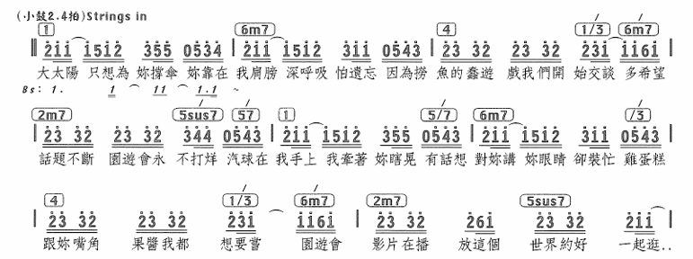

------

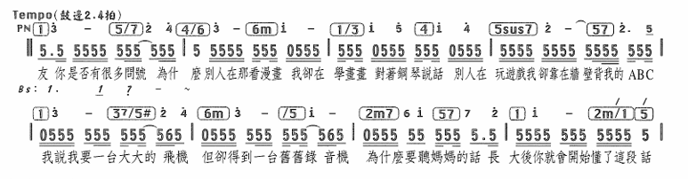

💡听妈妈的话是这段和声进行从头到尾，最后结尾用了 4m/1-1的变格终止，借用小调4级

------

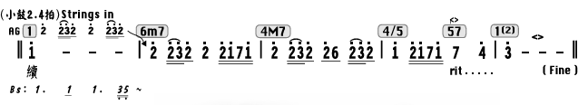

------

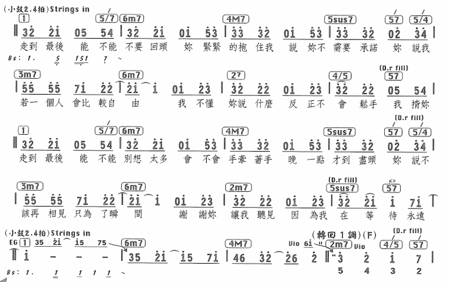

💡1645接五度循环，间奏同理然后251回到原调

------

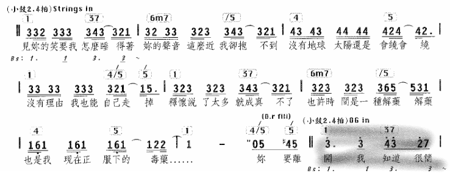

------

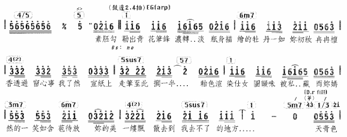

------

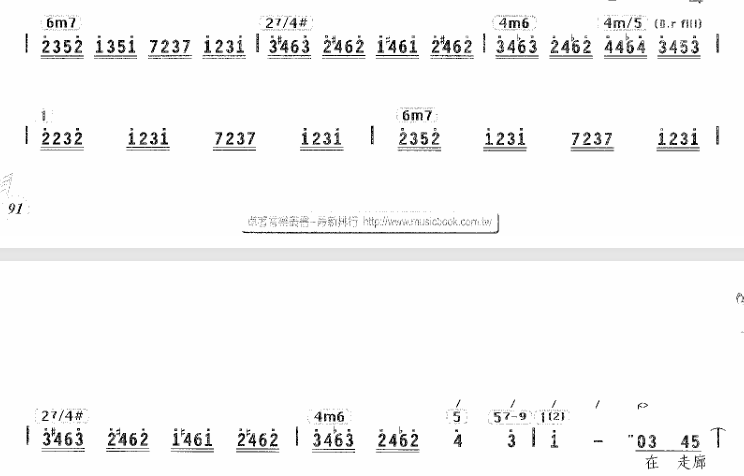

------

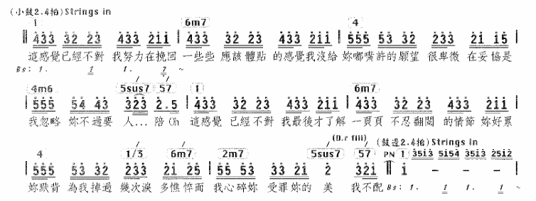

### 1-6-4-4

------

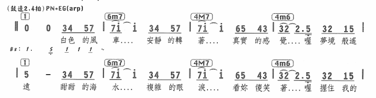

### 1-3-6-3

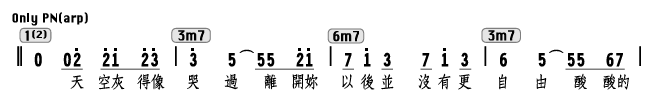

### 1-4-5-1

### 1-4-6-4

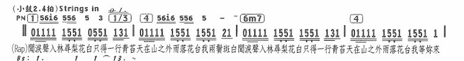

------

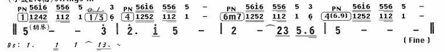

### 1-4-2-5

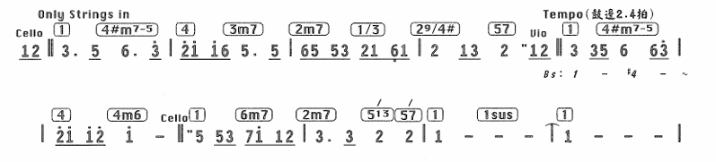

------

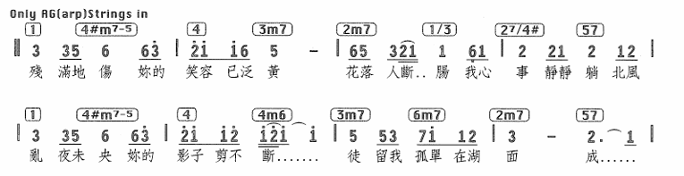

------

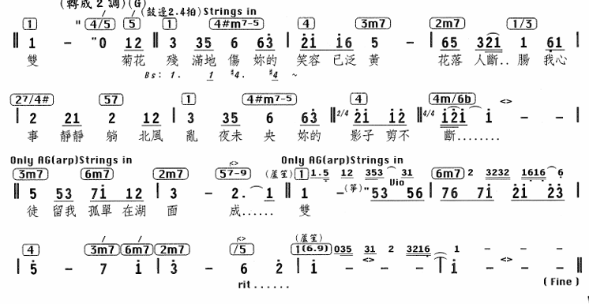

💡菊花台三段不同的和声演绎，以及最后阻碍终止的处理。这里顺便把尾奏1645也加进来了

### 1-5-6-4

------

------

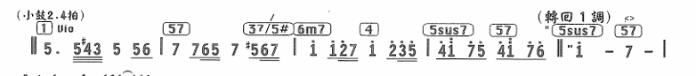

### 1-5-2-4

### 1-7b-4-3（6b）

### 1-4-2-4

### 6-4-5-1

------

------

------

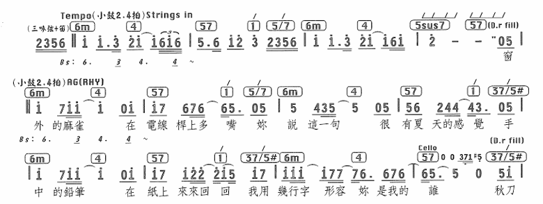

------

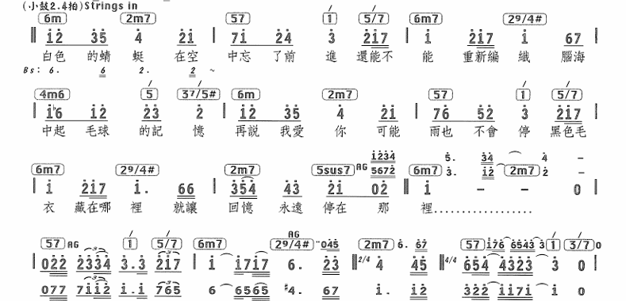

💡这里与王道进行融合

------

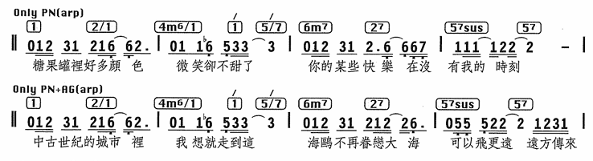

💡这里用到了持续低音和弦

### 6-3-4-1-6-3-2-5

### 6-4-1-1

### 6-5-4-5

### 6-2-4-3

### 6-5-4-3（5）

### 3-6-2-5

------

------

------

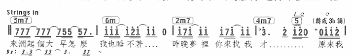

## S起手

### 4-3-2-5

------

### 4-6-2-2

### 4-3-6-1

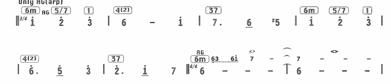

### 4-5-6-5-4-5-1

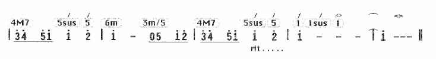

### 2-6-4-5

------

------

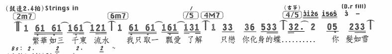

### 2-6-7-1（7b-5）

### 2-5-1-3

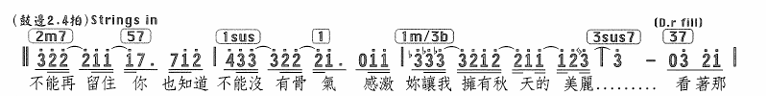

## D起手

### 7b-2-4-5

------

## 卡农进行

### 1-7-6-5-4-3-2-5

------

------

------

------

------

------

------

------

------

------

------

------

------

------

------

------

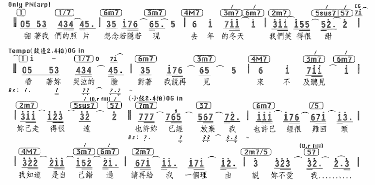

💡这两段是级进跳进的教科书用法

------

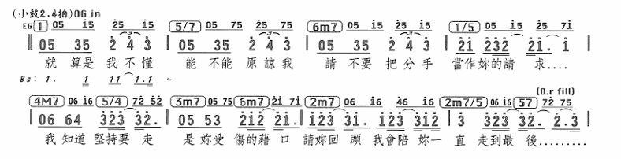

------

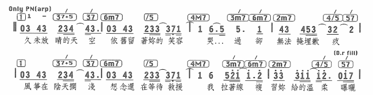

------

------

------

------

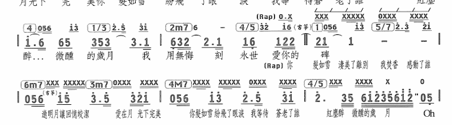

------

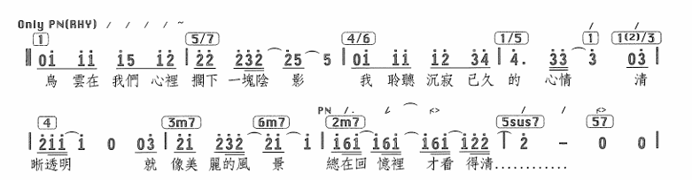

------

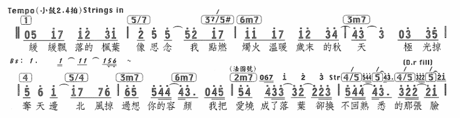

------

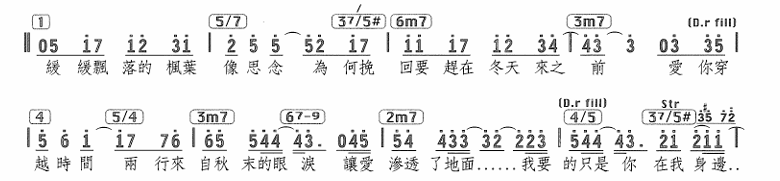

------

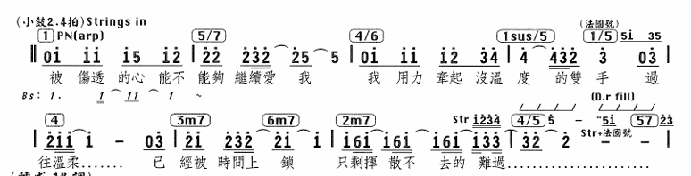

------

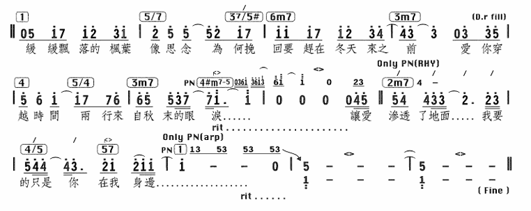

💡连续三张枫的和声进行，教科书的变化，最后一张主要观察其终止式

------

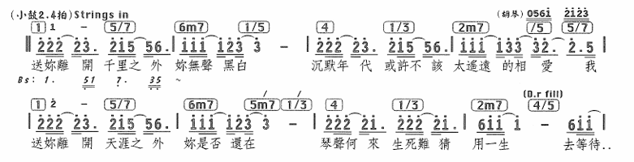

------

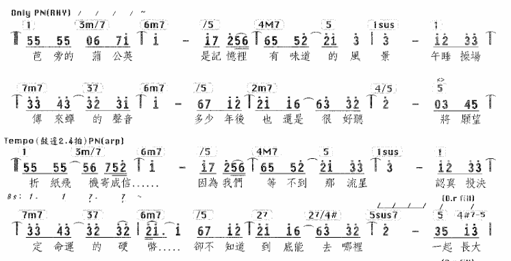

### 1-2-3-6-4-3-2-5

------

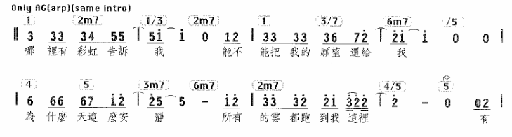

### 2-3-6-5-4-3-2-5

### 2-6-2-6-4-3-2-5

### 7-3-6-5-4-3-2-5

------

## 级进下行

### 6-5-4-3（4-3-2-1）

------

------

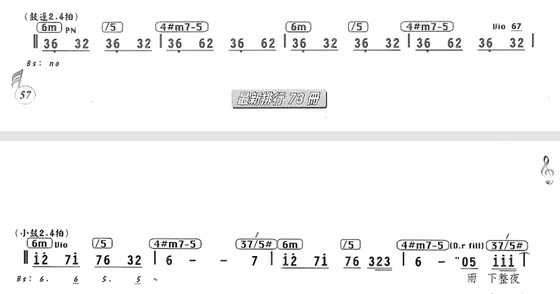

------

------

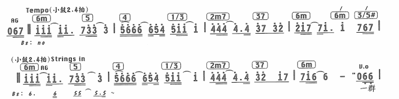

💡夜曲全曲都是这个小调进行循环

------

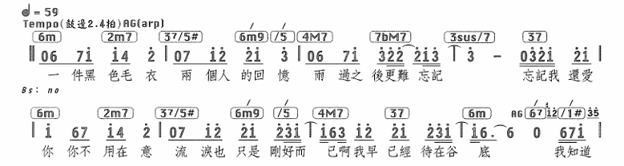

------

------

------

------

### 1-7-6-5-2-2-5-1

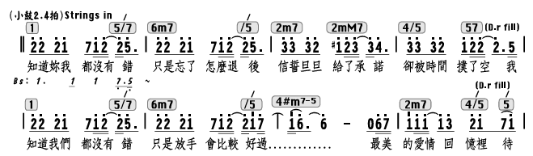

------

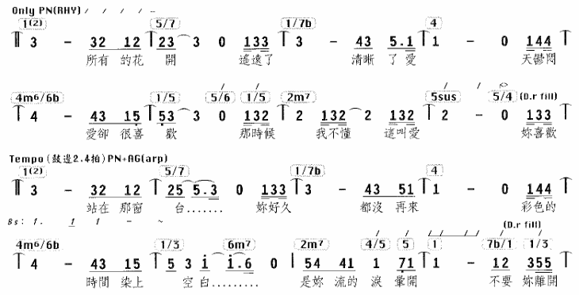

## 级进上行（Pre-Chord和Bridge用）

### 6-7-1-2-3-4-5

------

------

### 6-7-1--4-3-2-5

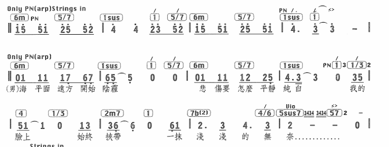

------

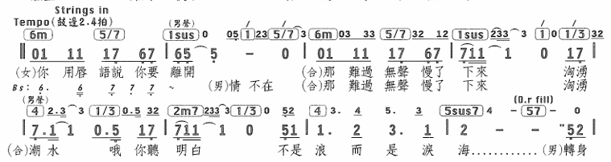

### 6-7-1-1-7-6-6b-5

### 6-7-1-3-4-5-1

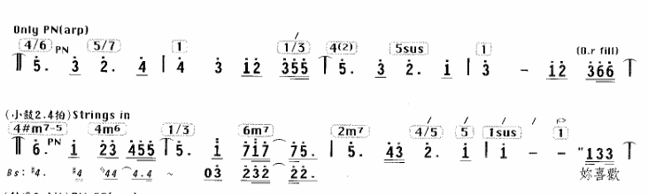

💡后面接王道进行

### 6-3-2-1-6-3-4-5

### 2-3-4-5（4）

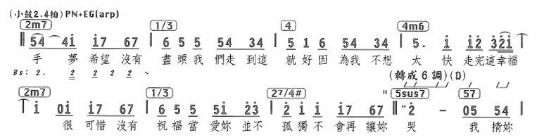

💡注意结尾的小三度转调

### 2-6-4-5-2-3-4-5

### 3-4-5-6-2-5-1

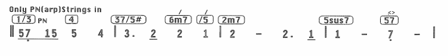

### 3-4-5-5

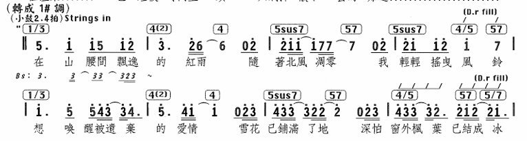

### 1-2-3-4

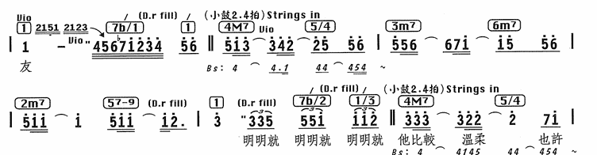

💡主要是1-2-3-4这里

## 王道进行

### 4-5-3-6-2-5-1

------

------

------

------

------

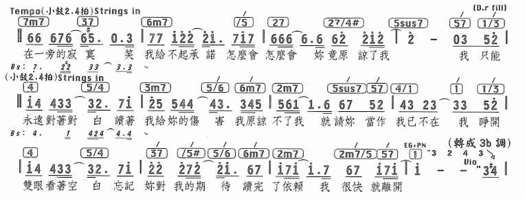

------

------

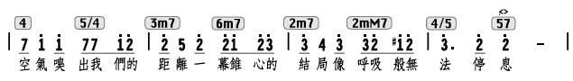

------

------

------

------

💡第二段副歌用5m7-1把终止的旋律再次拉回

------

------

💡最长的电影里面的副歌两段有意思的终止式和间奏尾奏放到一起，特别关注结尾的四拍刹车和弦，借用同主音小调的3级

------

------

💡同前奏，做了一些和声变化

------

------

💡很高级的251手法

------

💡综合卡农和王道的教科书写法，1级用了中国风味道的69和弦

------

------

💡阻碍终止

------

------

💡从主歌到副歌都用王道进行的教科书

------

------

💡这里间奏同主歌前2小节，节奏变得舒缓

### 4-5-3-6-2-3-4-5

------

------

💡这里把两种王道进行，pre和chorus、inter一块截图了

------

### 1-6-4-1-3-6-4-5

### 1-5-6-3-4-3-6b-5（2-5-1）

------

💡这里是251假终止的使用教科书，另外尾奏的144m1也一并在这里展示了吧

### 1-5-6-3-2-5-1

💡一直重复到结尾。

### 6-3-4-3-2-5-1

------

## 半音下行

### 4-3-3b-2

------

------

### 7b-6-6b-5

### 6-6b-5-4#-4-3-2-5

## 大小调互换

### 1-4m(2m)(借用Bb小调4级，转到Db大调2级)-5-1-6-2-7b-5

💡7b-5sus不知道是什么手法。后面的7-3-6是一个251又转回Bb大调，然后再次重复

### 1-7b-6-6b

💡大小调互换，第一个4m/6b其实是个6baug，1/7b也可以弹成17/7b

------

💡前两小节同前奏，后面是1625，第二段的主歌直接到Chorus所以加了一个副属和弦的解决，并且低音跳进到目标低音相邻音

## 小调和声

### 1-6b-5-4

------

### 1-6b-1-6-4-1-6b-5

### 看不懂。

💡尾奏时将1m改成1m69（中国风）

## 中古调式

### 1-2b(Phrygian)

## 中国风

### 169

## 前奏、间奏、尾奏（看不懂的进行）

### 1-4-1-4

------

💡一路向北前奏尾奏同和声进行；青花瓷尾奏也用到了1464

------

------

------

------

------

------

------

------

------

### 1-5-4-5

------

### 1-1-1-1

------

------

💡感觉是短暂停留的一个和弦进行

------

💡结尾是终止到1级，没有后面的25

------

### 1-1#-1-1#

### 1-7-2-4

### 1-1-1-6b-5-5

### 4-2-7b-6

### 6-6b-5-6-2-5-1-1

### 6-3-4-1-6-3-4-5

### 6-4-6-4

### 1-1-2-4

