## T起手
### 1-6-4-5

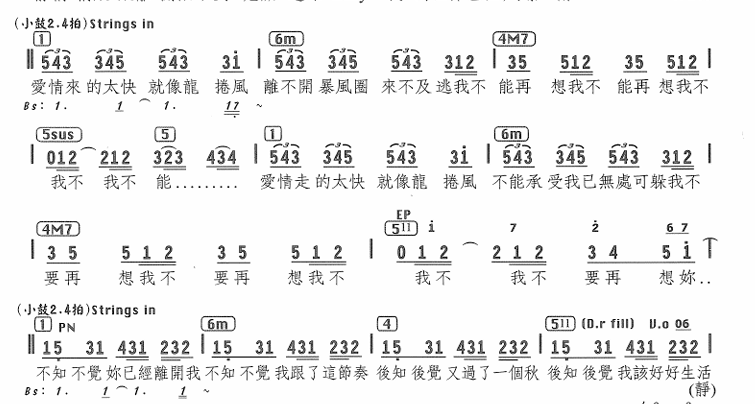

------

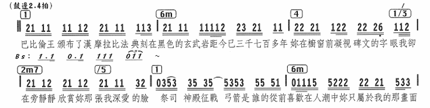

------

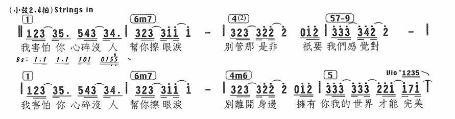

------

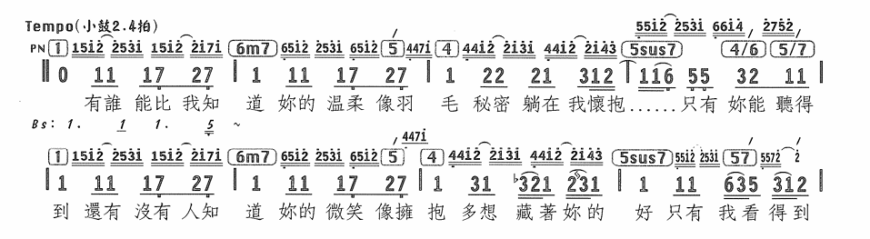

### 1-6-4-4

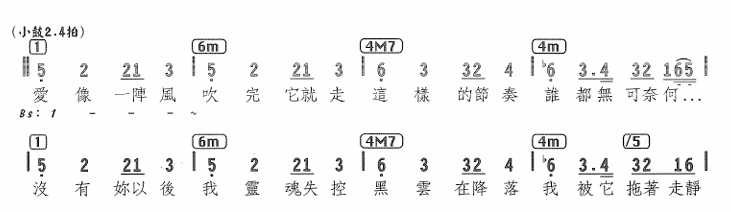

### 1-4-5-1

### 1-5-6-4

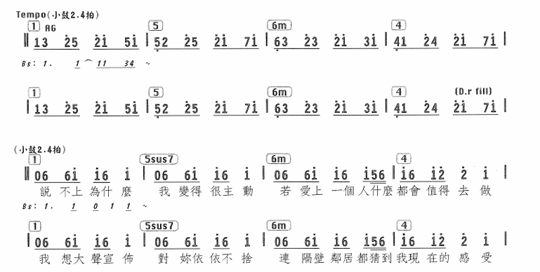

------

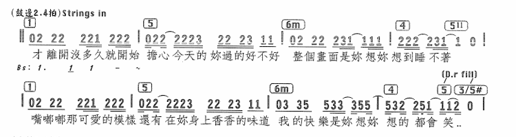

### 1-5-2-4

### 1-7b-4-3（6b）

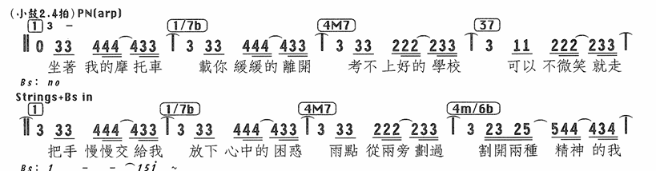

### 1-4-2-4

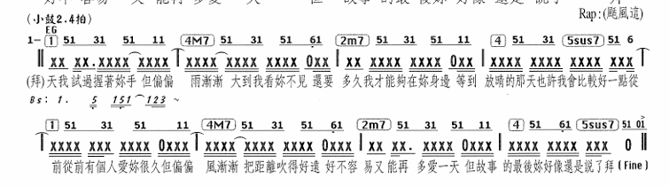

### 6-4-5-1

### 6-2-5-1

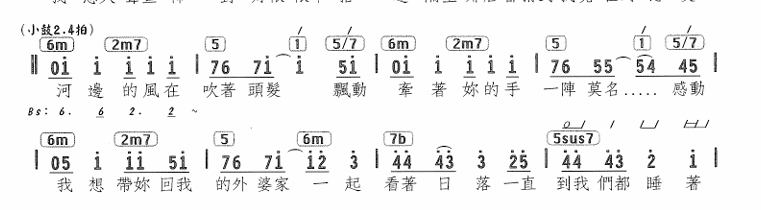

### 6-4-5-5

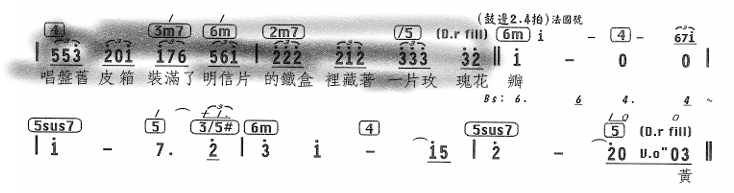

### 6-4-1-1

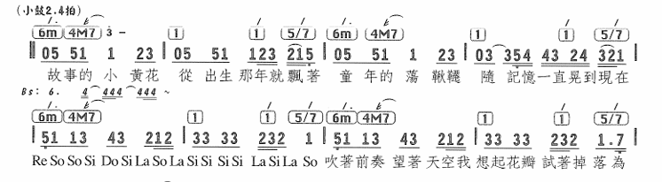

### 6-5-4-5

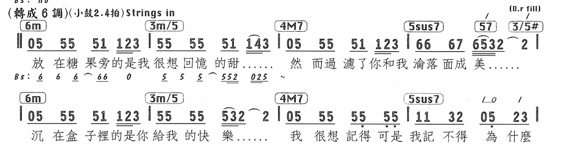

### 6-2-4-3

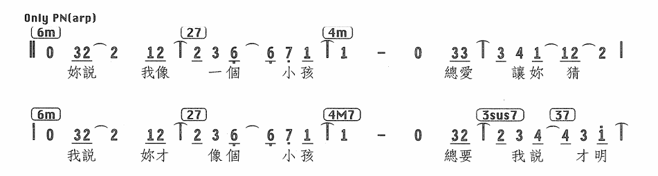

### 6-5-4-3（5）

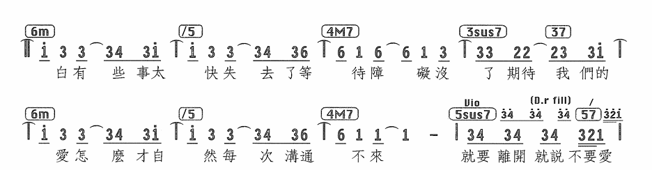

### 3-6-2-5

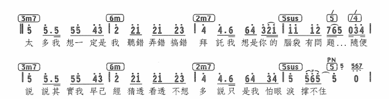

------

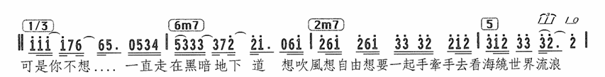

------

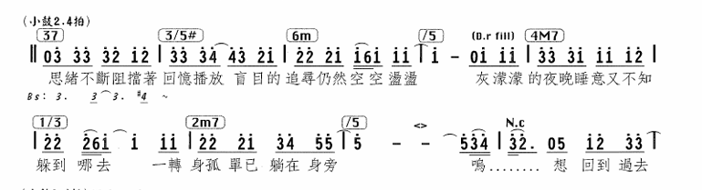

## S起手

### 4-3-2-5

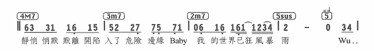

------

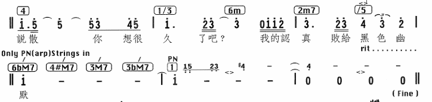

### 4-6-2-2

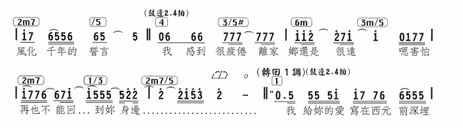

### 2-6-4-5

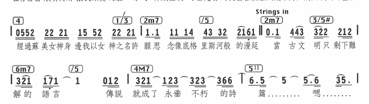

------

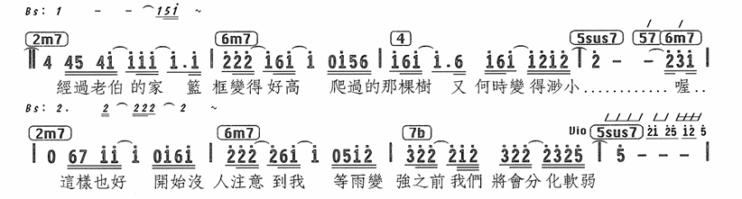

### 2-6-7-1（7b-5）

## D起手

### 7b-2-4-5

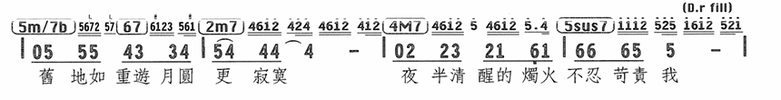

------

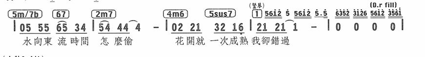

## 卡农进行

### 1-7-6-5-4-3-2-5

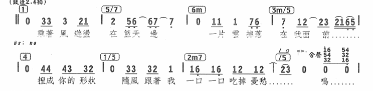

------

------

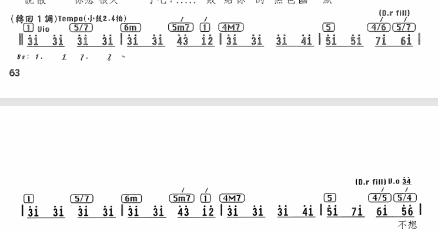

------

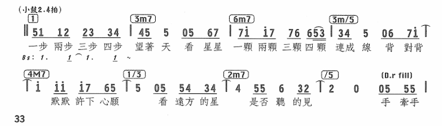

------

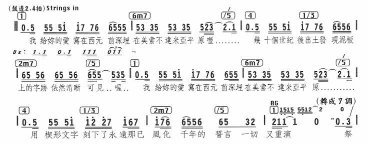

------

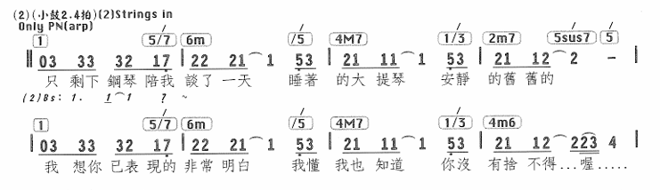

------

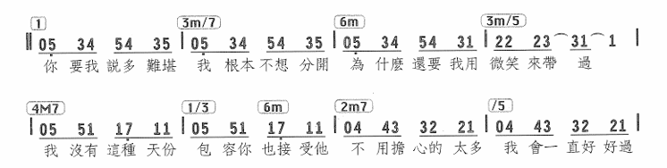

------

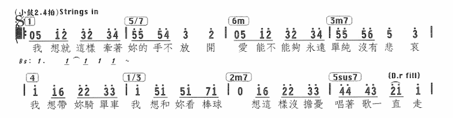

------

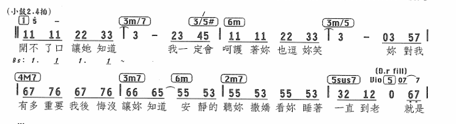

------

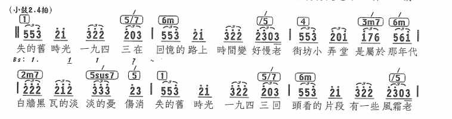

------

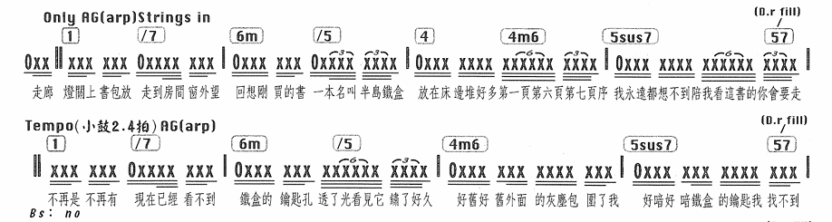

------

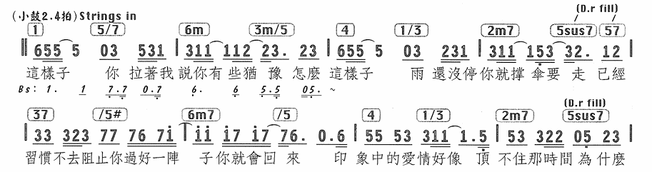

------

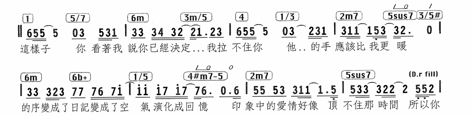

------

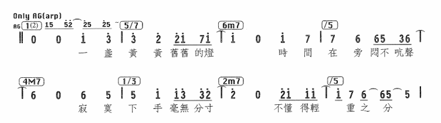

------

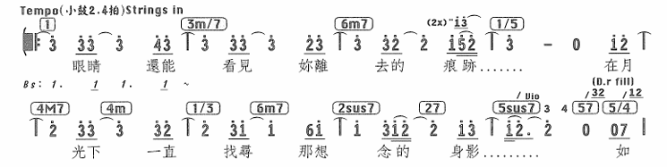

### 1-1-7-3-6-5-4-5

------

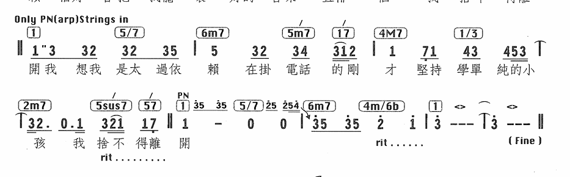

### 1-2-3-6-4-3-2-5

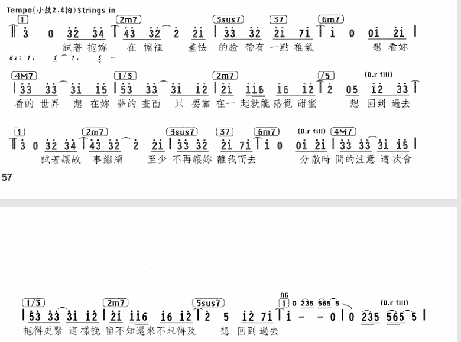

### 1-7-3-6-5-4-5-1

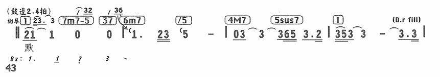

### 2-3-6-5-4-3-2-5

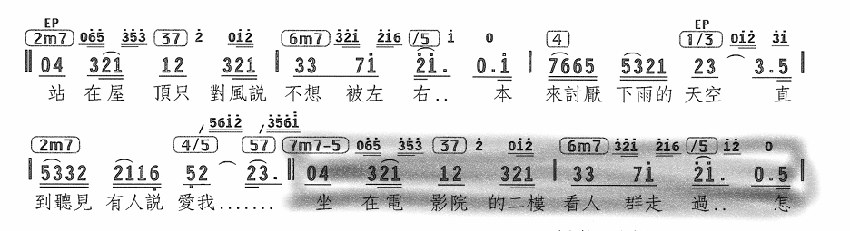

### 7-3-6-5-4-3-2-5

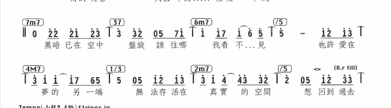

------

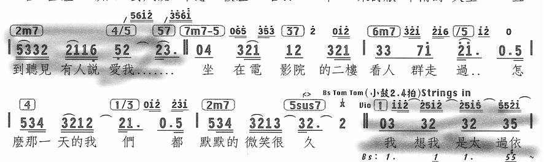

## 级进上行（Pre-Chord和Bridge用）

### 6-7-1-2-3-4-5

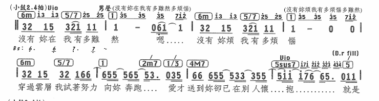

------

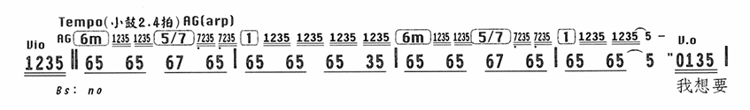

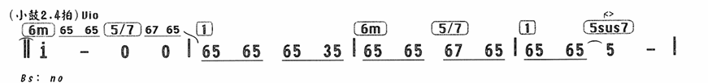

### 6-3-2-1-6-3-4-5

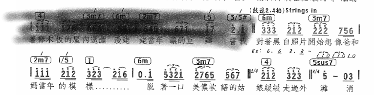

### 2-6-4-5-2-3-4-5

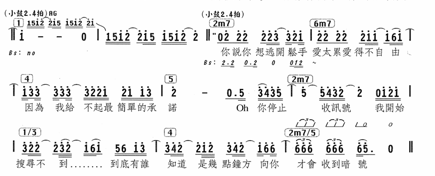

### 6-7-1-1-7-6-6b-5

## 级进下行

------

## 王道进行

### 4-5-3-6-2-5-1

------

------

------

### 2-5-3-6-2-3-4-5

### 1-6-4-1-3-6-4-5

### 1-5-6-3-4-3-6b-5（2-5-1）

------

💡这里是251假终止的使用教科书，另外尾奏的144m1也一并在这里展示了吧

## 半音下行

------

## 大小调互换

### 1-4m(2m)(借用Bb小调4级，转到Db大调2级)-5-1-6-2-7b-5

💡7b-5sus不知道是什么手法。后面的7-3-6是一个251又转回Bb大调，然后再次重复

## 小调和声

### 1-6b-5-4

## 中古调式

### 1-2b(Phrygian)

## 中国风

### 169

## 前奏、间奏、尾奏（看不懂的进行）

### 1-4-1-4

------

------

------

### 1-5-4-5

------

### 5/1-1-5/1-3

### 1-1#-1-1#

### 1-7-2-4

### 1-1-1-6b-5-5

### 4-2-7b-6

