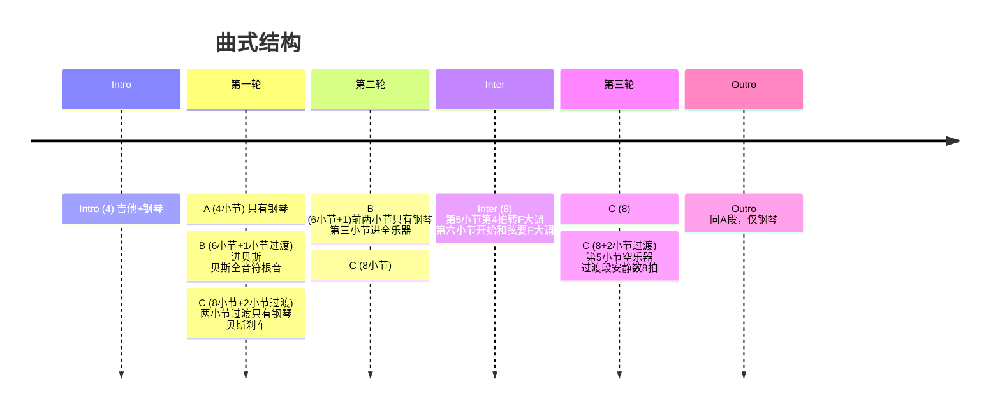

## 星辰大海

E大调转F大调

bpm：84    4/4

©未之夏

```mermaid
timeline
    title 曲式结构
    Intro : Intro (4) 吉他+钢琴
    第一轮   : A (4小节) 只有钢琴
            : B (6小节+1小节过渡) 进贝斯 贝斯全音符根音
            : C (8小节+2小节过渡) 两小节过渡只有钢琴 贝斯刹车
    第二轮   : B (6小节+1)前两小节只有钢琴 第三小节进全乐器
            : C (8小节)
    Inter   : Inter (8) 第5小节第4拍转F大调 第六小节开始和弦要F大调
    第三轮   : C (8)
            : C (8+2小节过渡) 第5小节空乐器 过渡段安静数8拍
    Outro : Outro 同A段，仅钢琴
```

